# Actions & Triggers

VoltOps Actions & Triggers connect your agents and workflows to external services:

- **Triggers** determine when your agents start running - responding to messages, emails, database changes, or cron schedules
- **Actions** push agent output to external systems - sending messages, creating records, or calling APIs

Both share the same credential system in the VoltOps console, so you authenticate once and use everywhere.

## How It Works

```mermaid
%%{init: {'theme':'dark', 'themeVariables': { 'primaryColor':'#10b981', 'primaryTextColor':'#fff', 'primaryBorderColor':'#10b981', 'lineColor':'#10b981', 'secondaryColor':'#1a1b1e', 'tertiaryColor':'#0f1011', 'background':'#0f1011', 'mainBkg':'#0f1011', 'nodeBorder':'#10b981', 'edgeLabelBackground':'#1a1b1e', 'labelColor':'#10b981'}}}%%
flowchart LR
    A["External Event<br/><small>Slack, Gmail, GitHub, etc.</small>"]
    B["Trigger<br/><small>Starts your agent</small>"]
    C["Agent/Workflow<br/><small>Processes the event</small>"]
    D["Action<br/><small>Sends output to SaaS</small>"]

    A -.detects.-> B
    B -.executes.-> C
    C -.calls.-> D

    style A fill:#0f1011,stroke:#10b981,stroke-width:3px,color:#fff,rx:10,ry:10
    style B fill:#0f1011,stroke:#10b981,stroke-width:3px,color:#fff,rx:10,ry:10
    style C fill:#0f1011,stroke:#10b981,stroke-width:3px,color:#10b981,rx:10,ry:10
    style D fill:#0f1011,stroke:#10b981,stroke-width:3px,color:#fff,rx:10,ry:10

    linkStyle 0 stroke:#10b981,stroke-width:2px,color:#10b981
    linkStyle 1 stroke:#10b981,stroke-width:2px,color:#10b981
    linkStyle 2 stroke:#10b981,stroke-width:2px,color:#10b981
```

## Triggers

Triggers monitor external services and execute your agents when events occur.

| Provider            | Description                                            | Delivery Method |
| ------------------- | ------------------------------------------------------ | --------------- |
| **Slack**           | Monitor workspace messages and channels                | Webhook         |
| **Gmail**           | Watch for emails with specific labels                  | Polling         |
| **Google Calendar** | React to calendar events (created, updated, cancelled) | Polling         |
| **Google Drive**    | Detect file or folder changes                          | Polling         |
| **Airtable**        | Detect record changes in bases and tables              | Polling         |
| **GitHub**          | Respond to repository events (PRs, issues, commits)    | Webhook         |
| **Schedule**        | Execute on cron expressions                            | Time-based      |

See the [Triggers documentation](./triggers/overview.md) to get started.

## Actions

Actions send data from your agents to external systems with managed credentials.

| Provider            | Description                        |
| ------------------- | ---------------------------------- |
| **Airtable**        | Create, update, and manage records |
| **Slack**           | Send messages and notifications    |
| **Discord**         | Send messages to channels          |
| **Gmail**           | Send and manage emails             |
| **Google Calendar** | Create and manage events           |
| **Google Drive**    | Upload and manage files            |
| **Postgres**        | Execute database queries           |

See the [Actions documentation](./actions/overview.md) to get started.
