# Triggers Overview

Triggers determine when your agents and workflows start running. They connect agents to external services or time-based schedules, responding to messages, emails, database changes, or recurring events. When you need to push agent output **out** to SaaS systems, pair triggers with [Actions](../actions/overview.md), which share the same credential system and observability.

## How Triggers Work

You create a trigger using three elements:

1. **Trigger** - The external service (Slack, Gmail, Airtable, GitHub) or cron schedule you connect to
2. **Binding** - Configuration that defines what to monitor (which channel, label, or schedule)
3. **Target** - The agent or workflow to execute when triggered

When an external event occurs (like a new Slack message or Airtable record update), the trigger detects it. The binding checks if the event matches your configuration. If it matches, the target executes.

```mermaid
%%{init: {'theme':'dark', 'themeVariables': { 'primaryColor':'#10b981', 'primaryTextColor':'#fff', 'primaryBorderColor':'#10b981', 'lineColor':'#10b981', 'secondaryColor':'#1a1b1e', 'tertiaryColor':'#0f1011', 'background':'#0f1011', 'mainBkg':'#0f1011', 'nodeBorder':'#10b981', 'edgeLabelBackground':'#1a1b1e', 'labelColor':'#10b981'}}}%%
flowchart LR
    A["External Event<br/><small>Slack, Gmail, GitHub, etc.</small>"]
    B["Trigger Fires<br/><small>Event detected</small>"]
    C["Binding Evaluates<br/><small>Match configuration</small>"]
    D["Target Executes<br/><small>Agent or Workflow runs</small>"]

    A -.detects.-> B
    B -.evaluates.-> C
    C -.executes.-> D

    style A fill:#0f1011,stroke:#10b981,stroke-width:3px,color:#fff,rx:10,ry:10
    style B fill:#0f1011,stroke:#10b981,stroke-width:3px,color:#fff,rx:10,ry:10
    style C fill:#0f1011,stroke:#10b981,stroke-width:3px,color:#fff,rx:10,ry:10
    style D fill:#0f1011,stroke:#10b981,stroke-width:3px,color:#10b981,rx:10,ry:10

    linkStyle 0 stroke:#10b981,stroke-width:2px,color:#10b981
    linkStyle 1 stroke:#10b981,stroke-width:2px,color:#10b981
    linkStyle 2 stroke:#10b981,stroke-width:2px,color:#10b981
```

 

### Where You Can Use Triggers

Triggers eliminate manual agent execution by responding to real-time events or running on schedules. Add automation capabilities to your agents respond instantly to customer actions, process data as it arrives, or run tasks on a schedule.

Here are some examples of what you can build:

**Customer Support Automation** - Run sentiment analysis agents when messages arrive in your Slack channel.

**Email Processing** - Automatically categorize and route emails with AI-powered workflows.

**Database Sync** - Process new or updated records from Airtable with data processing agents.

**CI/CD Integration** - Run code review agents when pull requests are opened on GitHub.

**Scheduled Reports** - Generate and send daily analytics reports with AI agents at specific times.

## Supported Trigger Providers

| Type                | Description                                            | Delivery Method |
| ------------------- | ------------------------------------------------------ | --------------- |
| **Slack**           | Monitor workspace messages and channels                | Webhook         |
| **Gmail**           | Watch for emails with specific labels                  | Polling         |
| **Google Calendar** | React to calendar events (created, updated, cancelled) | Polling         |
| **Google Drive**    | Detect file or folder changes                          | Polling         |
| **Airtable**        | Detect record changes in bases and tables              | Polling         |
| **GitHub**          | Respond to repository events (PRs, issues, commits)    | Webhook         |
| **Schedule**        | Execute on cron expressions                            | Time-based      |

## Next Steps

See [usage documentation](./usage.md) for step-by-step instructions on creating and managing triggers.
