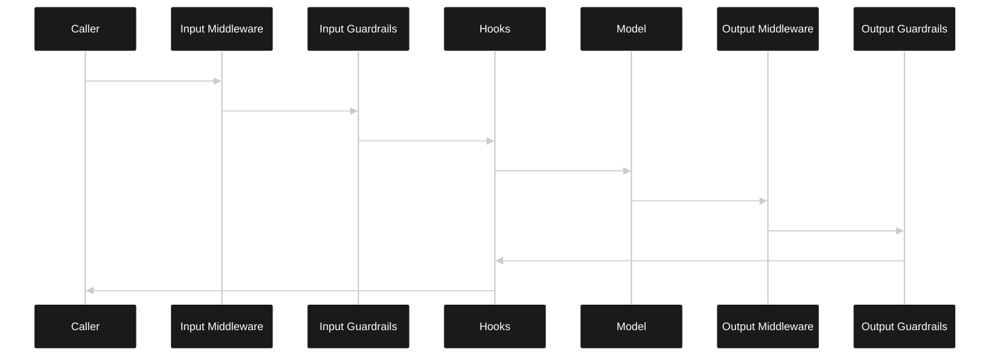

# Intercept Agent Calls with Middleware

Your agent returns something you don't want. Maybe the input needs sanitizing. Maybe the output needs validation before it reaches your user. You could wrap every call with try-catch and manual checks, but that gets messy fast.

VoltAgent middleware lets you intercept input and output at a single point—before guardrails and hooks even run.

## Why Middleware?

Without middleware, you end up wrapping every agent call with validation logic. Input sanitization in one place, output checks in another, retry logic scattered everywhere. It works, but it's hard to maintain and easy to miss edge cases.

Middleware centralizes this. Think of it like Express middleware, but for agent calls.

**Where this helps:**

- Support bots that need consistent response formatting (signatures, disclaimers)
- Data extraction agents where output must be valid JSON
- Multi-tenant apps where input needs tenant-specific prefixes
- Compliance scenarios requiring PII scrubbing before responses go out

**When to skip it:**

- Simple agents with straightforward I/O—just validate in your application code
- Streaming-heavy use cases where you need output middleware (it doesn't run during streams)

The key difference from hooks: middleware can modify values and abort calls. Hooks just observe.

## Execution Order

Here's when middleware runs relative to everything else:



For streaming calls, output middlewares don't run—the stream starts right after input processing.

## Basic Setup

Two types: input middleware and output middleware. Both can be set at agent level or per-call.

```ts
import { Agent, createInputMiddleware, createOutputMiddleware } from "@voltagent/core";

const normalizeInput = createInputMiddleware({
  name: "NormalizeInput",
  handler: ({ input }) => {
    if (typeof input !== "string") return input;
    return input.trim();
  },
});

const requireSignature = createOutputMiddleware<string>({
  name: "RequireSignature",
  handler: ({ output, abort }) => {
    if (!output.includes("-- Support")) {
      abort("Missing signature", { retry: true, metadata: { reason: "signature" } });
    }
    return output;
  },
});

const agent = new Agent({
  name: "Support",
  instructions: "Answer support questions with short, direct replies.",
  model: "openai/gpt-4o-mini",
  maxMiddlewareRetries: 1,
  inputMiddlewares: [normalizeInput],
  outputMiddlewares: [requireSignature],
});
```

The `normalizeInput` middleware trims whitespace. The `requireSignature` middleware checks that every response ends with a signature—if not, it aborts and retries.

## Per-Call Middleware

Need middleware just for one call? Pass it in the options:

```ts
await agent.generateText("hi", {
  inputMiddlewares: [({ input }) => (typeof input === "string" ? `Customer: ${input}` : input)],
});
```

Per-call middlewares run after agent-level ones.

## The Middleware API

Input middleware receives:

- `input` — current input value (might be modified by earlier middleware)
- `originalInput` — what the caller actually passed
- `agent`, `context`, `operation` — standard context
- `retryCount` — how many times this call has been retried
- `abort(reason?, options?)` — stop the call or request retry

Output middleware gets similar stuff, plus `output`, `originalOutput`, `usage`, `finishReason`, and `warnings` from the model.

Return a new value to replace input/output. Return nothing to keep the current value.

## Retry Behavior

This is where middleware gets powerful. You can make the agent retry its entire call if output doesn't meet your criteria.

```ts
const validateJson = createOutputMiddleware({
  name: "ValidateJSON",
  handler: ({ output, abort, retryCount }) => {
    try {
      JSON.parse(output);
      return output;
    } catch {
      if (retryCount < 2) {
        abort("Invalid JSON", { retry: true });
      }
      abort("Failed to produce valid JSON after retries");
    }
  },
});
```

Set `maxMiddlewareRetries` on the agent to control how many times this can happen. Default is 0 (no retries).

When a retry happens, the abort reason gets added as a system message—so the model knows what went wrong.

## Gotchas

**Middleware retries ≠ model retries.** Model retries (via `maxRetries`) handle API failures. Middleware retries handle bad outputs. They're separate counters.

**Streaming limits what you can do.** Output middleware doesn't run during streaming because the response is already flowing. You can only abort from input middleware before the stream starts.

**Order matters.** Agent-level middlewares run first, then per-call ones. Within each group, they run in array order.

## Wrapping Up

Middleware gives you a clean interception point for agent I/O. Check the [full documentation](https://voltagent.dev/docs/agents/middleware) for more patterns.
