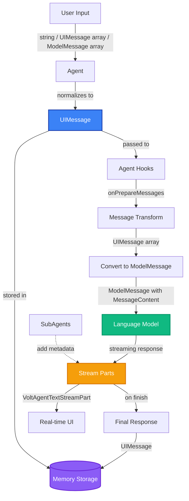

# Understanding Message Types

VoltAgent works with three different message type formats, each serving a specific purpose in the agent lifecycle. Understanding when and how to use each type is essential for building effective AI applications.

## Overview

The three message types are:

1. **MessageContent** - Raw content format for LLM communication (from AI SDK)
2. **UIMessage** - Frontend-friendly format with metadata (from AI SDK)
3. **VoltAgentTextStreamPart** - Streaming format with SubAgent support (VoltAgent extension)

These types come from the underlying AI SDK architecture and VoltAgent's multi-agent features. Rather than being redundant, they serve different layers of your application.

## The Three Message Types

### 1. MessageContent (AI SDK Content Type)

**MessageContent** represents the raw content that gets sent to language models. It's the `content` property of a `ModelMessage`.

#### Type Definition

```typescript
type MessageContent = UserContent | AssistantContent | ToolContent | string;

// Examples:
type UserContent = string | Array<TextPart | ImagePart | FilePart>;
type AssistantContent = string | Array<TextPart | ToolCallPart>;
type ToolContent = Array<ToolResultPart>;
```

#### Format

```typescript
// Simple string
const content: MessageContent = "Hello, how can I help you?";

// Structured array with multiple parts
const content: MessageContent = [
  { type: "text", text: "Check this image:" },
  { type: "image", image: "data:image/png;base64,..." },
  { type: "text", text: "What do you see?" },
];
```

#### When to Use

- ✅ Creating `ModelMessage` objects for AI SDK
- ✅ Direct LLM provider calls
- ✅ Low-level message manipulation
- ✅ Working with `message.content` property

#### Common Patterns

```typescript
import { generateText } from "ai";

// Using MessageContent in direct AI SDK calls
const result = await generateText({
  model: "openai/gpt-4",
  messages: [
    {
      role: "user",
      content: "Hello!", // MessageContent (string)
    },
    {
      role: "user",
      content: [
        // MessageContent (array)
        { type: "text", text: "Describe this:" },
        { type: "image", image: imageData },
      ],
    },
  ],
});
```

### 2. UIMessage (AI SDK UI Format)

**UIMessage** is the modern format designed for frontend applications, chat UIs, and memory systems. It includes metadata like message IDs and uses a `parts` array instead of `content`.

#### Type Definition

```typescript
interface UIMessage {
  id: string;
  role: "user" | "assistant" | "system";
  parts: Array<TextUIPart | FileUIPart | ToolUIPart>;
  createdAt?: Date;
  metadata?: Record<string, unknown>;
}
```

#### Format

```typescript
const message: UIMessage = {
  id: "msg-123",
  role: "user",
  parts: [
    { type: "text", text: "Hello, " },
    { type: "file", url: "image.png", mediaType: "image/png" },
    { type: "text", text: "what is this?" },
  ],
  createdAt: new Date(),
  metadata: { source: "mobile" },
};
```

#### When to Use

- ✅ Memory operations (`memory.getMessages()`, `memory.addMessage()`)
- ✅ Agent hooks (`onPrepareMessages`, `onAfterGeneration`)
- ✅ Chat UI rendering and state management
- ✅ Message history and conversation management
- ✅ Frontend/backend communication

#### Common Patterns

```typescript
import { Agent } from "@voltagent/core";

const agent = new Agent({
  memory: myMemory,

  hooks: {
    // UIMessages in hooks
    onPrepareMessages: async ({ messages }) => {
      // messages is UIMessage[]
      const enhanced = messages.map((msg) => ({
        ...msg,
        parts: [...msg.parts, { type: "text", text: " [verified]" }],
      }));

      return { messages: enhanced };
    },
  },
});

// Getting messages from memory
const conversationHistory = await memory.getMessages(userId, conversationId);
// Returns UIMessage[]

conversationHistory.forEach((msg) => {
  console.log(`[${msg.id}] ${msg.role}:`, msg.parts);
});
```

#### Feedback metadata

When feedback is enabled, VoltAgent attaches feedback metadata to assistant UI messages under `message.metadata.feedback`. This is how UIs can show thumbs up/down and submit feedback later.

```ts
const feedback = message.metadata?.feedback as
  | { traceId?: string; key?: string; url?: string }
  | undefined;

if (feedback?.url) {
  console.log("Submit feedback to:", feedback.url);
}
```

See [Feedback](/observability-docs/feedback) for the full flow and API examples.

### 3. VoltAgentTextStreamPart (Streaming Extension)

**VoltAgentTextStreamPart** extends AI SDK's `TextStreamPart` with SubAgent metadata, enabling multi-agent coordination during streaming.

#### Type Definition

```typescript
type VoltAgentTextStreamPart<TOOLS extends Record<string, any> = Record<string, any>> =
  TextStreamPart<TOOLS> & {
    /**
     * Optional response message identifier (carried on start/step chunks).
     */
    messageId?: string;

    /**
     * Optional identifier for the subagent that generated this event
     */
    subAgentId?: string;

    /**
     * Optional name of the subagent that generated this event
     */
    subAgentName?: string;
  };

// TextStreamPart types include:
// - text-delta
// - tool-call
// - tool-result
// - finish
// - error
// etc.
```

#### Format

```typescript
// Regular streaming part
const streamPart: VoltAgentTextStreamPart = {
  type: "text-delta",
  textDelta: "Hello",
};

// With SubAgent metadata
const subAgentStreamPart: VoltAgentTextStreamPart = {
  type: "text-delta",
  textDelta: "The answer is 42",
  subAgentId: "agent-calculator",
  subAgentName: "Calculator Agent",
};
```

#### When to Use

- ✅ Streaming responses (`agent.streamText()`)
- ✅ Real-time UI updates
- ✅ Multi-agent coordination and event forwarding
- ✅ Identifying which SubAgent is responding
- ✅ Building collaborative agent UIs

#### Common Patterns

```typescript
import { Agent } from "@voltagent/core";

const agent = new Agent({
  subAgents: [writerAgent, editorAgent],
});

// Streaming with SubAgent tracking
const stream = await agent.streamText("Write and edit a blog post");

for await (const part of stream.fullStream) {
  if (part.type === "text-delta") {
    // Check which SubAgent is responding
    if (part.subAgentId) {
      console.log(`[${part.subAgentName}]: ${part.textDelta}`);
    } else {
      console.log(`[Main Agent]: ${part.textDelta}`);
    }
  }
}
```

## Message Flow Diagram

Here's how messages flow through a typical VoltAgent application:



## Converting Between Types

VoltAgent and AI SDK provide utilities for converting between message formats:

### MessageContent ↔ UIMessage

```typescript
import { convertToModelMessages } from "ai";
import type { UIMessage } from "ai";

// UIMessage[] → ModelMessage[] (which contains MessageContent)
const uiMessages: UIMessage[] = await memory.getMessages(userId, conversationId);
const modelMessages = await convertToModelMessages(uiMessages);

// Access MessageContent from ModelMessage
const content = modelMessages[0].content; // MessageContent

// Extract text from either format using helpers
import { extractText } from "@voltagent/core";

const text1 = extractText(content); // From MessageContent
const text2 = extractText(uiMessages[0]); // From UIMessage (overloaded!)
```

### Working with Both Formats

VoltAgent's `messageHelpers` utilities support both formats:

```typescript
import { extractText, hasImagePart, extractImageParts } from "@voltagent/core";

// Works with MessageContent
const content: MessageContent = [
  { type: "text", text: "Hello" },
  { type: "image", image: "data:..." },
];

const text = extractText(content); // "Hello"
const hasImage = hasImagePart(content); // true

// Also works with UIMessage!
const message: UIMessage = {
  id: "msg-1",
  role: "user",
  parts: [
    { type: "text", text: "Hello" },
    { type: "file", url: "image.png", mediaType: "image/png" },
  ],
} as UIMessage;

const text2 = extractText(message); // "Hello"
const hasImage2 = hasImagePart(message); // true
const images = extractImageParts(message); // FileUIPart[]
```

See [Message Helpers](/docs/utils/message-helpers) for the complete API.

## Common Patterns and Use Cases

### Pattern 1: Memory + UIMessage

**Use Case**: Store and retrieve conversation history

```typescript
import { Agent } from "@voltagent/core";

const agent = new Agent({
  memory: myMemory,
});

// Generate response (automatically stores UIMessages in memory)
await agent.generateText({
  prompt: "Hello!",
  userId: "user-123",
  conversationId: "conv-456",
});

// Retrieve conversation history
const history = await myMemory.getMessages("user-123", "conv-456");
// Returns UIMessage[]

// Display in UI
history.forEach((msg) => {
  const text = extractText(msg);
  console.log(`${msg.role}: ${text}`);
});
```

### Pattern 2: Streaming + VoltAgentTextStreamPart

**Use Case**: Real-time UI updates with SubAgent identification

```typescript
import { Agent } from "@voltagent/core";

const coordinator = new Agent({
  subAgents: [researchAgent, writerAgent],
});

const stream = await coordinator.streamText("Research and write about AI");

// Track which agent is responding
let currentAgent = null;

for await (const part of stream.fullStream) {
  if (part.type === "text-delta") {
    // Detect agent switches
    if (part.subAgentId && part.subAgentId !== currentAgent) {
      currentAgent = part.subAgentId;
      console.log(`\n[Switching to: ${part.subAgentName}]`);
    }

    process.stdout.write(part.textDelta);
  }
}
```

### Pattern 3: Hooks + UIMessage Transformation

**Use Case**: Add context or filter sensitive data

```typescript
import { Agent, messageHelpers } from "@voltagent/core";

const agent = new Agent({
  hooks: {
    onPrepareMessages: async ({ messages }) => {
      // Add timestamps to user messages
      const enhanced = messages.map((msg) => {
        if (msg.role === "user") {
          return messageHelpers.addTimestampToMessage(msg);
        }
        return msg;
      });

      return { messages: enhanced };
    },

    onAfterGeneration: async ({ response }) => {
      // Filter sensitive data from assistant responses
      const filtered = messageHelpers.mapMessageContent(response, (text) => {
        // Redact SSN patterns
        return text.replace(/\b\d{3}-\d{2}-\d{4}\b/g, "[REDACTED]");
      });

      return { response: filtered };
    },
  },
});
```

## Decision Tree: Which Type Should I Use?

```
Are you working with...

┌─ Memory operations (store/retrieve)?
│  └─> Use UIMessage
│
├─ Agent hooks (transform messages)?
│  └─> Use UIMessage
│
├─ Streaming responses?
│  └─> Use VoltAgentTextStreamPart
│     └─ Need SubAgent tracking?
│        └─> Yes: Check subAgentId/subAgentName properties
│
├─ Direct AI SDK calls (generateText/streamText)?
│  └─> Use MessageContent (in ModelMessage.content)
│
├─ Chat UI rendering?
│  └─> Use UIMessage
│
└─ Message content manipulation?
   └─> Use messageHelpers (supports both MessageContent and UIMessage!)
```

## FAQ

### Q: Why not just one unified message type?

**A**: These types come from different layers of the AI SDK and serve different purposes:

- **MessageContent** is optimized for LLM communication (minimal structure)
- **UIMessage** is optimized for UIs and storage (includes metadata, IDs)
- **VoltAgentTextStreamPart** is optimized for streaming (real-time, event-based)

Unifying them would lose these optimizations and break compatibility with AI SDK.

### Q: Do I need to convert between types manually?

**A**: Usually not! VoltAgent handles conversions automatically:

- Agent automatically converts UIMessages to ModelMessages when calling LLMs
- Memory automatically stores responses as UIMessages
- `messageHelpers` utilities work with both MessageContent and UIMessage

You only need manual conversion for advanced use cases.

### Q: Which type does `memory.getMessages()` return?

**A**: Always **UIMessage[]**. Memory operations use UIMessage format for:

- Message IDs (tracking individual messages)
- Metadata (timestamps, sources, etc.)
- Frontend compatibility

### Q: Can I use MessageContent with message helpers?

**A**: Yes! All extractor and checker functions in `messageHelpers` support both:

```typescript
import { extractText } from "@voltagent/core";

// Both work!
extractText(messageContent); // MessageContent
extractText(uiMessage); // UIMessage
```

### Q: How do I know which SubAgent is responding in a stream?

**A**: Check the `subAgentId` and `subAgentName` properties:

```typescript
for await (const part of stream.fullStream) {
  if (part.subAgentId) {
    console.log(`SubAgent: ${part.subAgentName}`);
  } else {
    console.log("Main Agent");
  }
}
```

### Q: Are these types specific to VoltAgent?

**A**: No! **MessageContent** and **UIMessage** come from Vercel's AI SDK. Only **VoltAgentTextStreamPart** is a VoltAgent extension (adding `subAgentId` and `subAgentName` to AI SDK's `TextStreamPart`).

## Related Documentation

- [Message Helpers](/docs/utils/message-helpers) - Utilities for working with both MessageContent and UIMessage
- [Memory Guide](/docs/agents/memory) - How memory uses UIMessage format
- [Agent Hooks](/docs/agents/hooks) - UIMessage transformation in hooks
- [API Streaming](/docs/api/streaming) - Working with VoltAgentTextStreamPart

## Summary

| Type                        | Source    | Primary Use Case  | Key Features                       |
| --------------------------- | --------- | ----------------- | ---------------------------------- |
| **MessageContent**          | AI SDK    | LLM communication | String or array, minimal structure |
| **UIMessage**               | AI SDK    | UI & Memory       | Has `id`, `parts`, metadata        |
| **VoltAgentTextStreamPart** | VoltAgent | Streaming         | Has `subAgentId`, `subAgentName`   |

**Golden Rule**: Let VoltAgent handle conversions automatically. Use `messageHelpers` for content manipulation, and check the documentation for each API to know which type it expects.
